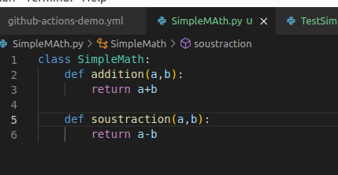
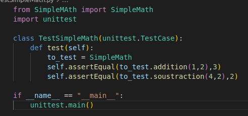
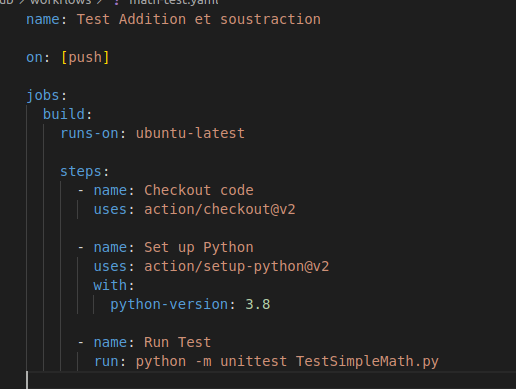
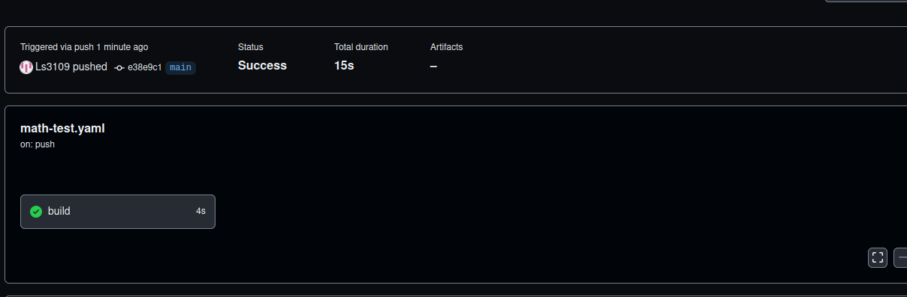
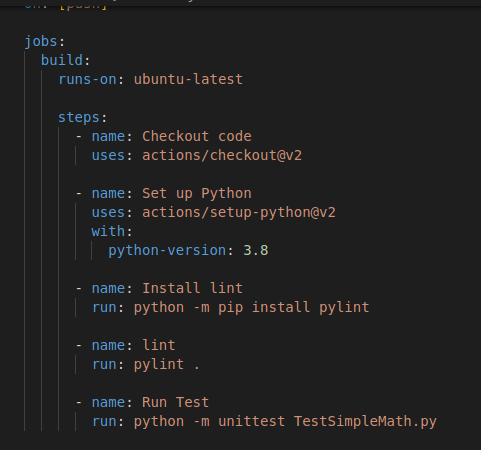
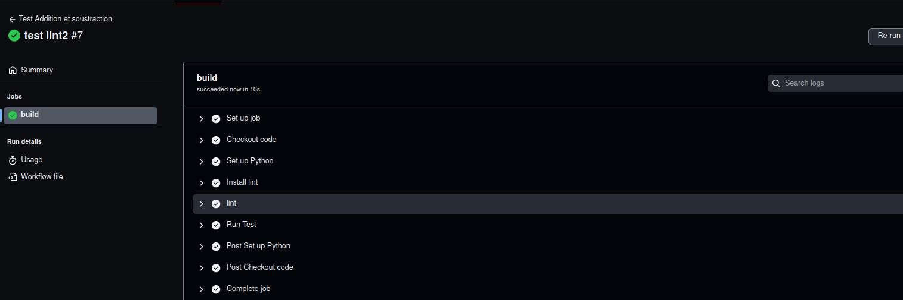

# Test-Github-Action

## 3. Création des classes

## 4. Configuration du fichier yaml pour le workflow

petite erreur de ma part sur le screen ci-dessus ce n'est pas action/... mais actions/...

## 6. lint

